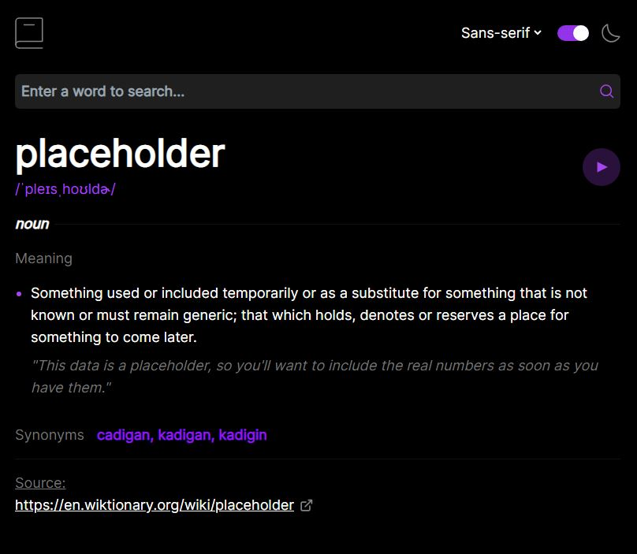
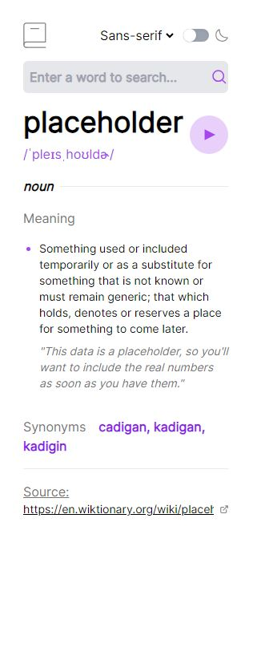

## Table of contents

- [Overview](#overview)
  - [The challenge](#the-challenge)
  - [Screenshot](#screenshot)
  - [Links](#links)
- [My process](#my-process)
  - [Built with](#built-with)
  - [What I learned](#what-i-learned)
  - [Continued development](#continued-development)

## Overview

### The challenge

Users should be able to:

- Search for words using the input field
- See the Free Dictionary API's response for the searched word
- See a form validation message when trying to submit a blank form
- Play the audio file for a word when it's available
- Switch between serif, sans serif, and monospace fonts
- Switch between light and dark themes
- View the optimal layout for the interface depending on their device's screen size
- See hover and focus states for all interactive elements on the page

### Screenshot

### Links

- Live Site URL: [Link](https://jyu-dictionary.netlify.app/)

## My process

### Built with

- Semantic HTML5 markup
- Tailwind CSS
- React Hook Form
- Mobile-first workflow
- [React](https://reactjs.org/) - JS library

### What I learned

I learned how to implement better forms by using React Hook Form, streamlining the process on creating good forms that have validation and user feedback. 

First time implementing a dark mode selector, which I will definitely include in all future projects as its one of the first things I look for on a bright website. 

Improved my responsive design using TailwindCSS, accounting for most common screen sizes.

### Continued development

Add a feature where you can click on synonyms / similar words and it will do a search of that words definition.

Store and show previous searches for easy searches.
